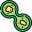

# Node-RED Amoeba Lifecycle Simulation Module

## Introduction

The `node-red-contrib-amoeba` module is a custom Node-RED node that simulates the life cycle of an amoeba at the molecular level, including DNA replication, RNA transcription, and protein translation. This simulation generates a random DNA sequence, replicates it, transcribes it into RNA, and then translates it into a protein sequence.



## Installation

To install the `node-red-contrib-amoeba` module, run the following command in your Node-RED user directory - typically `~/.node-red`:

```bash
npm install node-red-contrib-amoeba
```

## Usage

After installation, the amoeba node will be available in your Node-RED editor's palette, in the function category. Drag and drop the amoeba node onto the workspace, wire it into your flow and deploy.

The node takes in an input for triggering the simulation, and it emits a string representation of the protein formed at the end of the lifecycle simulation as the output. 

The output payload will have four parts:

- Original DNA: Generated randomly.
- Replicated DNA: The complementary DNA strand.
- RNA: Transcribed from the original DNA.
- Protein: Translated from the RNA.

## Contributing

Contributions to `node-red-contrib-amoeba` are welcomed! Please read our [contributing guidelines](./CONTRIBUTING.md) for more information on how to get involved.

## License

The `node-red-contrib-amoeba` module is licensed under [GNU General Public License v3.0](./LICENSE).

## Support

For any issues encountered or feedback, please file an issue on our [GitHub page](https://github.com/hj91/node-red-contrib-amoeba).

## Acknowledgements

This module is maintained by [Harshad Joshi](mailto:harshad@bufferstack.io).

## Purpose

The purpose of this module is to simulate the molecular life cycle of an amoeba, a simple organism, using a set of biological processes that occur within all living cells. These processes include DNA replication, RNA transcription, and protein translation.

Here's a brief overview of what the simulation does:

1. **DNA replication**: DNA replication is the process by which a DNA molecule makes a copy of itself. In this module, a random DNA sequence is generated, and a complementary strand is created based on the original strand.

2. **RNA transcription**: Transcription is the process by which the information in a strand of DNA is copied into a new molecule of messenger RNA (mRNA). In this module, the DNA is transcribed into RNA by replacing all occurrences of 'T' (Thymine) in the DNA sequence with 'U' (Uracil).

3. **Protein translation**: Translation is the process by which the mRNA produced in transcription is decoded to produce a specific protein. In this module, the RNA is translated into a protein sequence based on the codon-to-amino acid map.

This module could be used in an educational setting to illustrate these biological processes. It can be a useful tool for students learning about molecular biology, offering a simple and visual way to understand these complex processes. The module could also be used in research or in a bioinformatics pipeline to simulate or test how these processes occur.

It's important to note that this is a highly simplified model of these processes and doesn't take into account many of the more complex aspects of molecular biology, such as introns and exons, regulatory sequences, and post-translational modifications, among other things. (ToDo)
